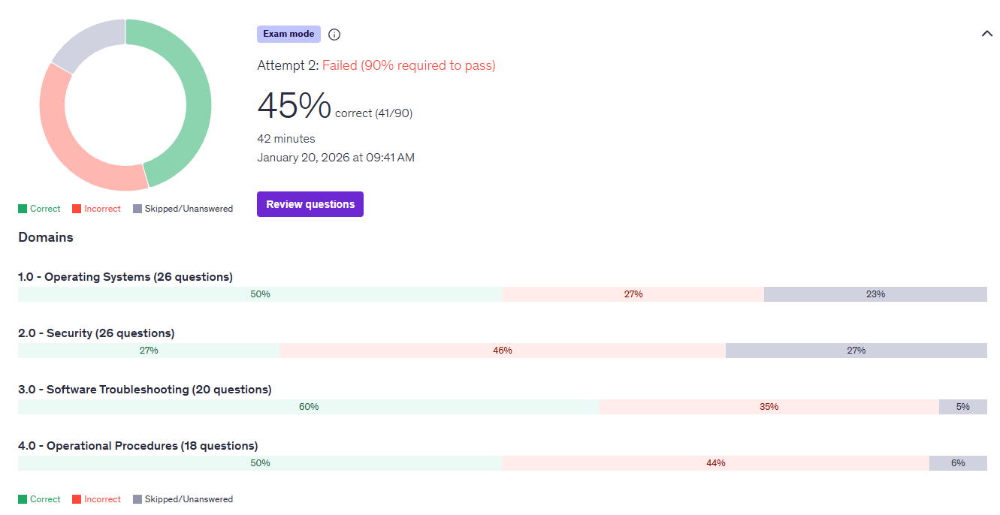
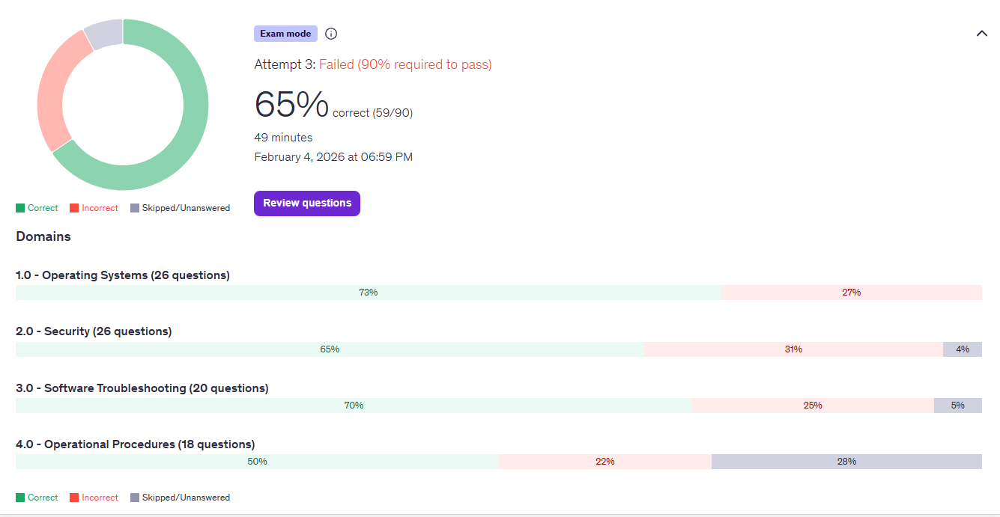
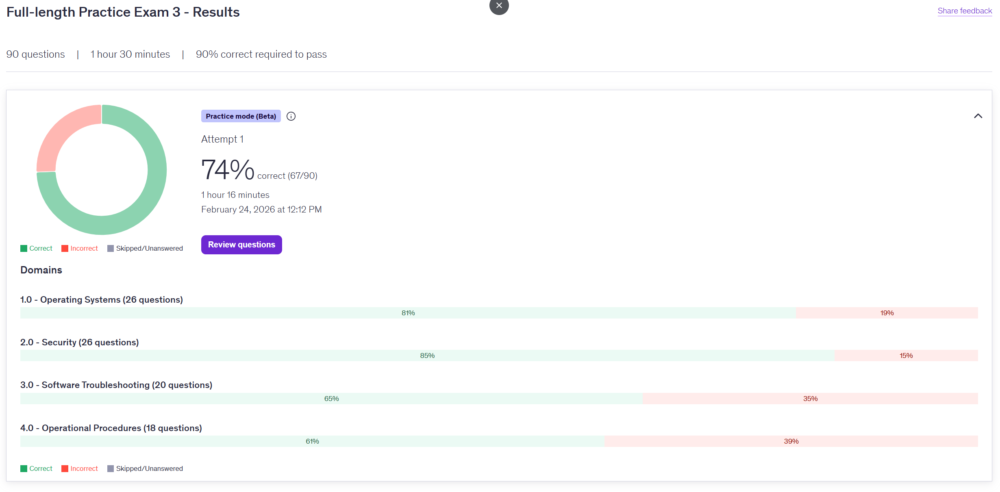
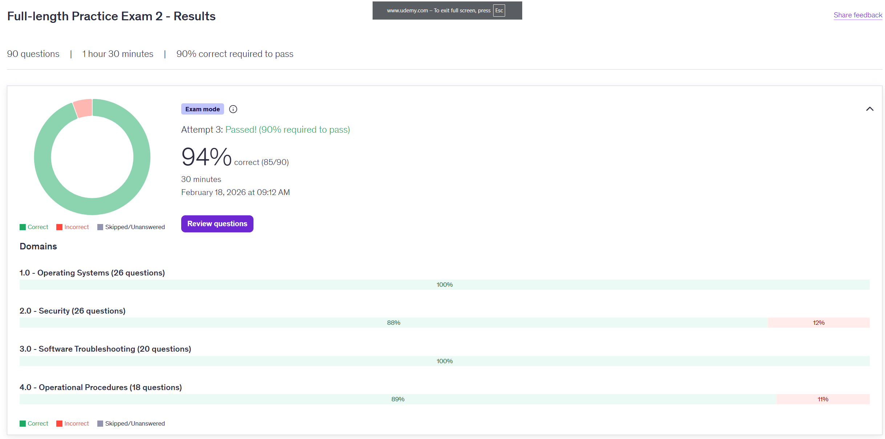

# CompTIA-APlus-Study-Log

**Status:** Completed

## 🧠 My Study Method
I plan to take practice tests, identify knowledge gaps, target those weak areas, and repeat.  

## 🗝️ Key
* 🟥 ≤ 60%
* 🟨 61% - 79%
* 🟩 ≥ 80%

## 📚 Resources
* [Jason Dion Practice Exams (Udemy)](https://www.udemy.com/share/10dIrv3@Qs-B6-HlTDqKwjwFxhs7OWg-R2X_QzDoQYwXK4spkYe16lbNkkJQF9a7n0vVfXe4aQ==/)
* [Professor Messer Core 2 Playlist](https://youtube.com/playlist?list=PLG49S3nxzAnlLZsWd16Me1ZEI5OeCbdud&si=RF-Fu6HcOMVdkNVd)
* [Personally made quizgames to memorize Methodologies] (link removed for privacy)

---

> [!NOTE]
>  Skipping `Practice Test 1: Attempt 1`. Accidentally started it in the wrong mode ➡️ Ended it immediately.

---

## 📉 Practice Test 1: Attempt 2 (No Prior Studying)(No Actual Prior Attempts(Read Above))
*Date: Jan 20, 2026*

### 🟥 Operating Systems (50%)
* **PXE boot** = Boot over the network, usually to install or upgrade an image.
* **File Systems**
  * **NTFS** = NewTechFileSys- Windows Default, read only on Mac (natively).
  * **FAT32** = USB, SD, Legacy ~ 4gb limit.
  * **exFAT** = extended FAT ~ FAT32 but no 4gb limit.
  * **APFS** = 🍎FileSys- Default for Mac, iOS, iPadOS - strong encryption.
  * **HFS+** = outdated APFS.
  * **ext4** = Default for linux
  * **ext3** = outdated ext4
  * **swap** = virtual storage for ram overload.
  * **NFS** = linux files over network
  * **CDFS/UDF** = Standard for Optical Media (CDs, DVDs, Blu-rays).
* **Linux "dd"** = Disk Duplicator - Clones raw data (bit-for-bit).
* **Repair vs Refresh install** = both keep personal file, refresh removes software.
* **---Windows 10 (64x) Minimum Requirements---** =  1GHz(1000mhz) processor, 2 GB RAM, 20 GB storage.
* **---Windows 11 Minimum Requirements---** =  dualcore 1GHz(1000mhz) processor, 4 GB RAM, 64 GB storage.
* **IP's**
  * **10.0.0.0** = class A - Enterprise / Large Corp
  * **172.16.0.0** = class B - Medium Biz / Containers
  * **192.168.0.0** = class C - Home / Small Office
  * **127.0.0.0** = loopback / selfhost
  * **169.254.0.0** = APIPA (Automatic Private IP Addressing) - self-assigned IP, DHCP Error.

### 🟥 Security (27%)
* **HDD Data Removal** = high-powered magnetic degausser device
* **Malware**
  * **Ransomware** = Encrypts data -> Demands payment for decryption.
  * **Worm** = Self-replicating.
  * **Virus** = Requires human action (e.g., opening a file)
  * **Trojan** = Disguises as legitimate software -> create backdoor
  * **Rootkit** = hidden deep in os -> Grants "ROOT."
  * **Spyware** = Runs silently. Collects data
  * **Botnet** = A network of infected computers ("zombies") controlled remotely -> often for DDoS attacks.
* **Hardware token** = A generic category of security devices that require a physical device to log in to a computer.
* **WEP Encryption** = considered a weak form of encryption and should not be used
* **DLP (Data Loss Prevention)** = detects and prevents potential data breachesby monitoring, detecting, and blocking sensitive data.

### 🟥 Software Troubleshooting (60%)
* **bootrec** = command line in the Recovery Environment.
  * **/rebuildbcd** = "OS Not Found" / "BCD Missing" finds every Windows installation on the drive and adds them to the BCD (Boot Configuration Data) store.
  * **/fixmbr** = Fixes the Master Boot Record. The "Table of Contents" of your hard drive.
  * **/fixboot** = repairs the specific code at the start of the C: drive that hands off control to Windows. Write a new Boot Sector to the system partition.
  * **/scanos** = "Scanned 1 disk. Found Windows installations: 1." (It changes nothing).
* **regsvr32** = used to register and unregister DLL (Dynamic Link Library).

### 🟥 Operational Procedures (50%)
* **SOP** = standard operating procedure ~ step by step procedure

---

## 📉 Practice Test 1: Attempt 3 (1 previous actual attempt)
*Date: Feb 4, 2026*

### 🟨 Operating Systems (73%)
* Unattended installations require user input
* system file checker (SFC) = ScanForCorrupt oh and restore
### 🟨 Security (65%)
* Types of attack
 * On-path attack 
  * Man in the middle
 * ARP poisoning 
  * ARP connect IP to Mac
  * Hacker screams " I'm 192.168.1.5" router send hacker your data
 * SQL injection 
 * Cross-site scripting / XSS
* Password cracking 
 * Brute Force 
 * Dictionary Attack
 * Rainbow table 
* Admin policies 
 * Least privilege 
 * Separation of duties 
 * Mandatory vacation 
* Protocols 
 * TACACS+ (terminal access controller access-controller system)
 * RADIUS (remote authentication dial-in user system)
 * Kerberos
 * HIDS (host intrusion detection system)
 * HIPS (host intrusion protection system)
 * NIDS
  * HIDS but for the whole network, not just one host
 * NIPS
  * HIPS but for the whole network, not just one host
### 🟨 Software Troubleshooting (70%)
* Defragging
 * File fragments are put together to speed up the drive.
* Domain Controller
 * Authorizes who in a large company has access to what.
* Proxy vs VPN
 * Proxy tunnels/cache for one app (usually browser), while VPN is a full tunnel for everything coming from your pc
### 🟥 Operational Procedures (50%)
* Acronyms 
    * *Domain 4.6* group 1(secret data) 
        * 'PII' (personal identification information)
                * Anything that can identify a person
                * Example: SSN
  * 'PCI-DSS' (payment card information - Data security standard)
      * Rules for handling credit card info
     * 'PHI' (protected health care information)
      * Medical Records
    * *Domain 4.6* group 2(rules and laws)
     * 'AUP' (acceptable use policy)
     * 'DRM' (Digital Millennium Copyright)
      * Software lock pirate prevention 
  * 'EULA' (end user licensing agreement)
   * Contract for using the software 
  * 'NDA' (non-disclosure agreement)
    * *Domain 4.5* (physical and safety)
     * 'MSDS' (material safety data sheet)
      * Instruction manual for chemicals
      * Example: ink cartridge exploded
  * 'UPS' (uninterruptible power supply)
   * Giant battery backup 
  * 'ESD' (electrostatic discharge)
    * *Domain 4.1* (paperwork)
     * 'SLA' (service level agreement)
      * The promise
      * Example: Server will be up in 4 hours
  * 'SOP' (standard operating procedure)
   * Step-By-Step instructions
* File Extensions
 * .bat
  * Windows old
 * .ps1
  * Powershell
 * .vbs
  * Windows modern
 * .sh
  * Shell
 * .py 
  * Python is cross-platform
 * .js
  * JavaScript 
* Change Management (Domain 4.2)
 * *Formally asking permission, before making a change*
 * **Memorize these** steps in order
  1. The Request 
  2. Risk Analysis 
  3. Approval
  4. Backout Plan
  5. Implement 
  6. Verify / Test
  7. Document
  * Raving Rabbits Are Biting Into Very Deeply.

---

> [!NOTE]
> All of the following tests were done in practice-mode sessions where I reviewed each question in real-time; consequently, no separate study notes were recorded.
> Additionally, GitHub was inaccessible during the lunch breaks where I took my test, preventing updates.

## 📉 Practice Test 3: Attempt 1 

### 🟩 Operating Systems (81%)
### 🟩 Security (85%)
### 🟨 Software Troubleshooting (65%)
### 🟨 Operational Procedures (61%)

---

## 📉 Practice Test 2: Attempt 1 

### 🟩 Operating Systems (100%)
### 🟩 Security (88%)
### 🟩 Software Troubleshooting (100%)
### 🟩 Operational Procedures (89%)
